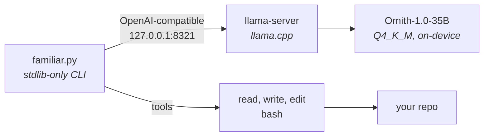

<p align="center">
  
</p>

# The Wizard's Familiar

**A coding agent that runs entirely on your machine. One file, no dependencies, no cloud.**

[](https://github.com/wizards-ecosystem/wizards-familiar/actions/workflows/ci.yml)
[](LICENSE)

**Status: working, public.** It runs and is used. It is not finished.

## Why it exists

My team paused cloud AI while we reworked cost limits. Rather than lose the momentum, I
built a coding agent that runs on my own laptop: no hosted model, no API key, no
per-token cost, and nothing about my code leaving the machine.

It turned into a good exercise in how much a capable coding assistant actually needs,
versus how much a heavy toolchain just adds. The answer was one Python file and zero
dependencies.

## What it is

Two pieces, about a thousand lines total:

| File | Role |
| --- | --- |
| **`familiar.py`** | The entire agent. Stdlib-only Python CLI: agent loop, tool calling, a raw-mode line editor, context management, streaming |
| **`serve.sh`** | The model launcher. Runs Ornith-1.0-35B (Q4_K_M GGUF) through llama.cpp's OpenAI-compatible `llama-server`, auto-scaling context to your GPU's wired limit |



Nothing in that diagram leaves the laptop.

## Requirements

- macOS on Apple Silicon. A 32 GB Mac runs the 35B at Q4. This is the only platform that
  is tested and supported.
- Python 3.11 or newer.
- About 21 GB of disk for the model.
- `brew install llama.cpp`, which provides `llama-server`.

## Install

```sh
git clone https://github.com/wizards-ecosystem/wizards-familiar
cd wizards-familiar
pip install .
```

That puts two commands on your `PATH`: `familiar` runs the agent, and `familiar-serve`
starts the model. Installing pulls in no runtime dependencies, because there are none.

You can skip the install and run the scripts directly instead. `./familiar.py` and
`./serve.sh` work from a clone with nothing installed.

## Quickstart

```sh
# 1. Get the model, about 21 GB
mkdir -p ~/Models && curl -L -C - --retry 100 --retry-all-errors \
  -o ~/Models/ornith-1.0-35b-Q4_K_M.gguf \
  "https://huggingface.co/deepreinforce-ai/Ornith-1.0-35B-GGUF/resolve/main/ornith-1.0-35b-Q4_K_M.gguf"

# 2. Start the model in one terminal and leave it running. Ready in about 5s, serves :8321
familiar-serve

# 3. Point the agent at a repository in another terminal
familiar ~/dev/some-repo
```

Whatever folder Familiar starts in is the workspace. Drop a `FAMILIAR.md` in a repository
with its build commands, layout and conventions, and it is appended to the system prompt
automatically.

Ornith-1.0-35B is published by a third party. Check its licence and terms on Hugging Face
before using it for anything that matters. This project does not redistribute the model
and does not verify the download beyond what `curl` reports.

## What it can do to your machine

Familiar runs shell commands chosen by a language model, as you, with no sandbox and no
approval prompt. That is the design, not an oversight. It can read and write anything you
can, and a repository you did not write can influence what it tries next.

Two limits hold and are tested: git is restricted to a read-only allowlist, and `/plan`
disables the editing tools entirely. Neither constrains `bash`.

Run it on a clean git working tree so every edit is reviewable with `git diff`. Read
[SECURITY.md](SECURITY.md) before pointing it at code you do not trust.

## Features

### Context that sizes itself

On startup Familiar probes the `/props` endpoint of `llama-server` and sets its budget to
about 80% of the server's real window, leaving headroom so a long reasoning turn is never
truncated. A live meter sits above every prompt:

```
ctx 12.3k / 105k tokens (12%)
```

Those counts are the server's actual usage, requested through
`stream_options.include_usage`, not a character estimate. Past budget the oldest turns
drop first, and it says so. `/tokens` breaks usage down by role and shows the measured
prompt and completion split.

### A real line editor, from the standard library

No `readline` dependency:

- Enter submits. Shift+Enter and Alt+Enter insert a newline
- Bracketed paste, so multi-line pastes stay intact instead of firing on the first newline
- Up and down recall history, persisted to `~/.familiar_history`, last 1000, surviving reboots
- Left, right, Home, End, Ctrl-A, Ctrl-E movement, Ctrl-W word delete, Ctrl-U clear line,
  Ctrl-C abandon

Real Shift+Enter needs a terminal that speaks the kitty keyboard protocol: kitty, Ghostty,
WezTerm, or iTerm2 3.5 and later. Everywhere else, including Terminal.app, use Alt+Enter,
which is Option+Enter with "Use Option as Meta key" enabled. Paste works everywhere.

### Loop-breakers for a local model

A 35B model run locally gets stuck in ways a hosted model does not, so several pieces
exist to break those loops. An unchanged file is not re-read. A tool call identical to the
previous one is skipped. An edit with no check after it gets one nudge to verify. A bare
`cat` is routed through the read tool so re-dumps dedupe. Reading a directory lists it
instead of erroring.

Each of those has a case in the selftest pinning the behavior it was written for.

### Context window scaling

`serve.sh` sizes `-c` from the memory actually available, which is the GPU wired cap, or
about 75% of RAM when none is set, minus the model. It reports what it found:

```
serve.sh: cap=28672 MB, model=20186 MB, headroom=8486 MB -> -c 131072
```

A 64 GB Mac gets 131k with no setup. A 32 GB Mac gets 64k at the stock wired limit, and
131k if you raise it:

```sh
sudo sysctl iogpu.wired_limit_mb=28672
```

That resets on every reboot. If `serve.sh` reports a smaller context than you expect, that
is why, and it prints the exact command to raise it again. If the model cannot fit at all
it says so and exits, rather than failing deep inside llama.cpp.

Raising the wired limit is the only thing that helps. Closing applications does not: the
limit is a hard cap on GPU memory no matter how much RAM is free.

### Readable output

Reasoning streams dim, answers stream normal, and tool calls print on their own line as
the tool name plus its first argument.

## Commands

| Command | Does |
| --- | --- |
| `/help` | Key bindings and commands |
| `/new` | Clear the conversation, keeping the system prompt |
| `/plan` | Toggle read-only plan mode. Explore and propose, no edits |
| `/tokens` | Context usage, broken down by role |
| `/quit` | Exit, as does Ctrl-D on an empty line |

## Configuration

| Variable | Effect |
| --- | --- |
| `FAMILIAR_CTX_TOKENS` | Override auto-sizing with a fixed context budget |
| `FAMILIAR_URL` | Server base URL. Default `http://localhost:8321/v1` |
| `FAMILIAR_MODEL` | Model name sent with the request. Default `local` |
| `FAMILIAR_BASH_TIMEOUT` | Seconds before a shell command is killed. Default 300 |
| `FAMILIAR_HISTFILE` | Prompt history file. Default `~/.familiar_history` |
| `FAMILIAR_MODEL_PATH` | Read by `serve.sh`. Path to the GGUF |

## Tests

```sh
./familiar.py --selftest   # agent loop, edits, git guard, input editor, token meter. No model needed, about 1s
./test_serve.sh            # serve.sh's context picker at the measured boundaries
```

The selftest stands up two mock servers and drives the real agent loop, so it is a genuine
test rather than a smoke check. Both suites run on every push.

## Why stdlib only

A coding agent you drop onto a new machine should not arrive with a dependency tree you
have to audit. No framework, no lockfile, no supply chain, just Python's standard library
and a local model. That keeps it small enough to read end to end and trust, which matters
more for a tool that edits your files than for most software.

`pyproject.toml` exists so that `pip install .` can give you a working command. Its
dependency list is empty, and CI fails if that ever stops being true.

## Contributing

See [AGENTS.md](AGENTS.md) for the working standards, and the organization's
[CONTRIBUTING](https://github.com/wizards-ecosystem/.github/blob/main/CONTRIBUTING.md).
Report security concerns through [SECURITY.md](SECURITY.md), not a public issue.

## License

[MIT](LICENSE).

---

<sub>Built by <a href="https://isaaclimb.com">Isaac Limb</a>. Part of <a href="https://github.com/wizards-ecosystem">The Wizard's Ecosystem</a>.</sub>
