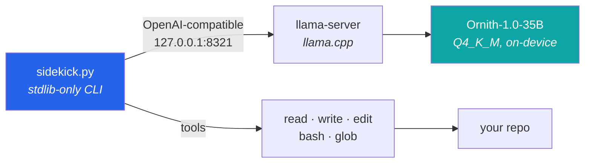

<div align="center">

# Orinth Sidekick

**A coding agent that runs entirely on your machine. One file, no dependencies, no cloud.**

[](https://www.python.org/)
[](#why-stdlib-only)
[](#what-it-is)
[](#why-it-exists)
[](#requirements)

</div>

---

## Why it exists

My team paused cloud AI while we reworked cost limits. Rather than lose the momentum, I built a
coding agent that runs on my own laptop: no hosted model, no API key, no per-token cost, and nothing
about my code leaving the machine.

It turned into a good exercise in how much a capable coding assistant actually needs, versus how
much a heavy toolchain just adds. The answer was **one Python file and zero dependencies**.

## What it is

Two pieces, about a thousand lines total:

| File | Role |
|---|---|
| **`sidekick.py`** | The entire agent. Stdlib-only Python CLI: agent loop, tool calling, a raw-mode line editor, context management, streaming. No `pip install`, ever. |
| **`serve.sh`** | The model launcher. Runs Ornith-1.0-35B (Q4_K_M GGUF) through llama.cpp's OpenAI-compatible `llama-server`, auto-scaling context to your GPU's wired limit. |



Nothing in that diagram leaves the laptop.

## Requirements

- **macOS, Apple Silicon.** A 32 GB Mac runs the 35B at Q4.
- **~21 GB of disk** for the model.
- `brew install llama.cpp` (provides `llama-server`).

## Quickstart

```sh
# 1. Get the model (~21 GB, SHA-256 verified against Hugging Face)
mkdir -p ~/Models && curl -L -C - --retry 100 --retry-all-errors \
  -o ~/Models/ornith-1.0-35b-Q4_K_M.gguf \
  "https://huggingface.co/deepreinforce-ai/Ornith-1.0-35B-GGUF/resolve/main/ornith-1.0-35b-Q4_K_M.gguf"

# 2. Start the model (terminal 1, leave running — ready in ~5s, serves :8321)
./serve.sh

# 3. Point it at a repo (terminal 2)
sidekick ~/dev/some-repo
```

Whatever folder Sidekick starts in **is** the workspace. Drop a `SIDEKICK.md` in a repo (build
commands, layout, conventions) and it's appended to the system prompt automatically.

## Features

### Context that sizes itself

On startup Sidekick probes `llama-server`'s `/props` and sets its budget to **~80% of the server's
real window**, leaving headroom so a long reasoning turn is never truncated. A live meter sits above
every prompt:

```
ctx 12.3k / 105k tokens (12%)
```

Those counts are the server's **actual** usage (requested via `stream_options.include_usage`), not a
character estimate. Past budget, the oldest turns drop first and it says so. `/tokens` breaks usage
down by role and shows the measured prompt/completion split.

### A real line editor, from the standard library

No `readline` dependency:

- **Enter** submits · **Shift+Enter** / **Alt+Enter** insert a newline
- **Bracketed paste** — multi-line pastes stay intact instead of firing on the first newline
- ↑/↓ history, persisted to `~/.sidekick_history` (last 1000, survives reboots)
- ←/→/Home/End/Ctrl-A/Ctrl-E movement, Ctrl-W word-delete, Ctrl-U clear line, Ctrl-C abandon

> Real **Shift+Enter** needs a terminal that speaks the kitty keyboard protocol (kitty, Ghostty,
> WezTerm, iTerm2 ≥ 3.5). Everywhere else — including Terminal.app — use **Alt+Enter** (Option+Enter,
> with "Use Option as Meta key" enabled). Paste works everywhere.

### Context window scaling

`serve.sh` sizes `-c` from the memory actually available — the GPU wired cap (or ~75% of RAM when
none is set) minus the model — and reports what it found:

```
serve.sh: cap=28672 MB, model=20186 MB, headroom=8486 MB -> -c 131072
```

A 64 GB Mac gets 131k with no setup. A 32 GB Mac gets 64k at the stock wired limit, and 131k if you
raise it:

```sh
sudo sysctl iogpu.wired_limit_mb=28672
```

**That resets on every reboot.** If `serve.sh` reports a smaller context than you expect, that's
why — it prints the exact command to re-raise it. If the model can't fit at all, it says so and
exits instead of failing deep inside llama.cpp.

> Raising the wired limit is the only thing that helps. Closing apps doesn't: the limit is a hard
> cap on GPU memory no matter how much RAM is free.

### Readable output

Reasoning streams dim, answers stream normal, tool calls print as `→ name arg`.

## Commands

| Command | Does |
|---|---|
| `/help` | Key bindings and commands |
| `/new` | Clear context for a lean, focused chat |
| `/tokens` | Context usage, broken down by role |
| `Ctrl-D` | Quit |

## Tests

```sh
./sidekick.py --selftest   # agent loop, edits, input editor, token meter — no model needed, ~1s
./test_serve.sh            # serve.sh's context picker at the measured boundaries
```

## Why stdlib only

A coding agent you drop onto a new machine shouldn't arrive with a dependency tree you have to
audit. No framework, no package manager, no lockfile, no supply chain — just Python's standard
library and a local model. That keeps it small enough to read end to end and trust, which matters
more for a tool that edits your files than for most software.

## Environment

| Variable | Effect |
|---|---|
| `SIDEKICK_CTX_TOKENS` | Override auto-sizing with a fixed context budget |

---

<div align="center">
<sub>Built by <a href="https://isaaclimb.com">Isaac Limb</a> · <a href="https://isaaclimb.com/projects/orinth-sidekick.html">Project writeup</a></sub>
</div>
